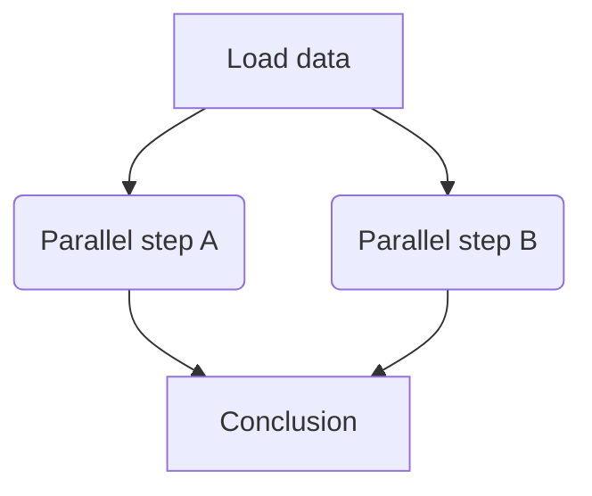

# Rbanism Scalable GIS Challenge submission 

The submission consists of the following steps:

1. Fill in the project information in the form below;
2. Submit this issue by clicking on **Submit new issue** without deleting the text below;
3. Add your workflow diagram, making sure that its content (e.g., text, visual elements) is legible;
4. Write down the self-assessment in max. 300 words;
5. Submit the issue. Note that you can continue editing your submission on GitHub, and it will not be reviewed until you have completed the following step;
6. Add another comment letting @cforgaci know that the submission is ready for assessment.

## Project information
- Project title:
- Author(s): 
- Type of work: [e.g., PhD thesis chapter, conference paper, research project report]
- Status: work in progress / finished but not published / published

## Research question:
[Replace this text with your answer]

## Scalability challenge:
[Replace this text with your answer]

## Workflow diagram:
[Replace this text with the workflow diagram or a link to it]

You can use any tool you want to create a workflow diagram (drag-and-drop an image, for instance). Here is an example inside Markdown, using [mermaid](https://mermaid.js.org/intro/n00b-gettingStarted.html):

## Narrative Self-Assessment (max. 300 words):
[Replace this text with your answer]
